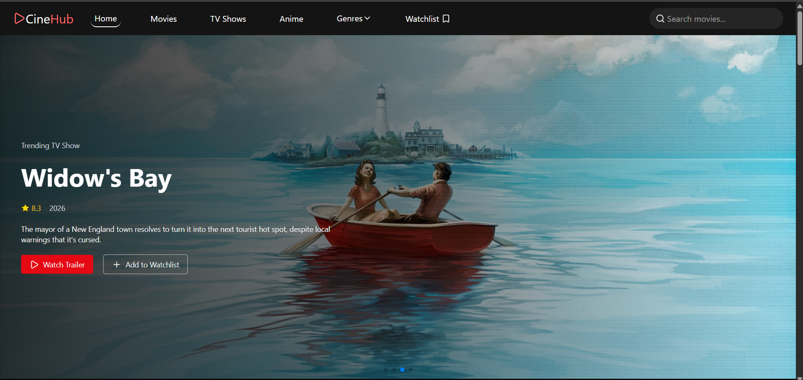
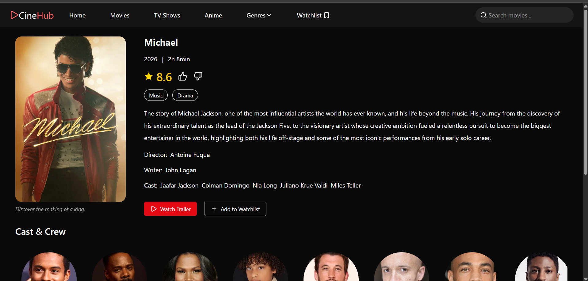
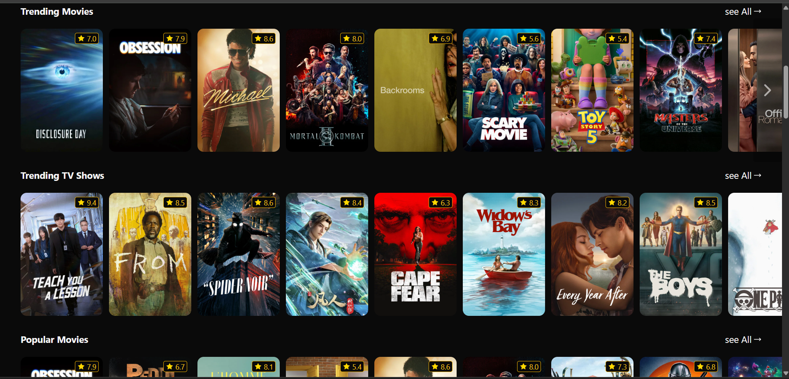

# 🎬 CineHub

A Netflix-inspired movie discovery app built with React. Browse trending movies & TV shows, watch trailers, manage your watchlist, and explore content by genre — all powered by the TMDB API.

**[🚀 Live Demo →](https://cinehub-movie.vercel.app/)**

---

## 📸 Preview





---

## ✨ Features

- 🎥 **Trending Content** — Auto-rotating banner with movies & TV shows fetched in parallel
- 🔍 **Search** — Debounced URL-based search with real-time results
- 🎞️ **Trailers** — Watch trailers in a modal without leaving the page
- ❤️ **Like / Dislike** — React to content; preferences saved to localStorage
- 📌 **Watchlist** — Add/remove titles; persisted across sessions via localStorage
- 🎭 **Genre Browsing** — Explore movies and TV shows filtered by genre
- 📱 **Responsive Design** — Fully mobile-friendly with a hamburger nav

---

## 🛠️ Tech Stack

| Technology          | Purpose                         |
| ------------------- | ------------------------------- |
| React 18            | UI library                      |
| React Router DOM v6 | Client-side routing             |
| Tailwind CSS v4     | Styling with custom dark theme  |
| Swiper.js           | Banner carousel                 |
| Axios               | API requests                    |
| Context API         | Global state (watchlist, likes) |
| TMDB API            | Movie & TV show data            |
| Vercel              | Deployment                      |

---

## 🏗️ Architecture Highlights

- **Custom Hooks** — `useFetchMovies` with `AbortController` for clean data fetching, `useTrailer` for trailer logic, `useDebounce` for search optimization
- **Context API** — Global state management for watchlist and like/dislike, synced with `localStorage`
- **URL-based Search** — Search state lives in the URL via `useSearchParams`, making it shareable and browser-back-compatible
- **Parallel Fetching** — Banner fetches multiple content types simultaneously using `Promise.all`
- **Code Splitting** — Route-level lazy loading for better initial load performance

---

## 🚀 Getting Started

### Prerequisites

- Node.js v18+
- A free [TMDB API key](https://www.themoviedb.org/settings/api)

### Installation

```bash
# Clone the repo
git clone https://github.com/YOUR_USERNAME/cinehub.git
cd cinehub

# Install dependencies
npm install

# Create environment file
cp .env.example .env
```

Add your TMDB API key to `.env`:

```env
VITE_TMDB_API_KEY=your_api_key_here
```

```bash
# Start development server
npm run dev
```

---

## 📁 Project Structure

```
src/
├── components/        # Reusable UI components (NavBar, GridCard, TrailerModal...)
├── context/           # Context API providers (WatchlistContext, LikeContext)
├── hooks/             # Custom hooks (useFetchMovies, useTrailer, useDebounce)
├── pages/             # Route-level pages (Home, SearchPage, GenresPage, MovieInfo...)
└── main.jsx           # App entry point with Router setup
```

---

## 🔑 Environment Variables

```env
VITE_TMDB_API_KEY=        # Your TMDB API v3 key
```

> ⚠️ Never commit your `.env` file. It's already in `.gitignore`.

---

## 📄 License

This project is open source and available under the [MIT License](LICENSE).

---

## 🙋‍♂️ Author

**Amit**

- GitHub: [@ak067640](https://github.com/ak067640)
- LinkedIn: [Amit Kumar Gautam](https://www.linkedin.com/in/amit-kumar-gautam-5878391a0/)

---

_Built with ❤️ using React & TMDB API_
